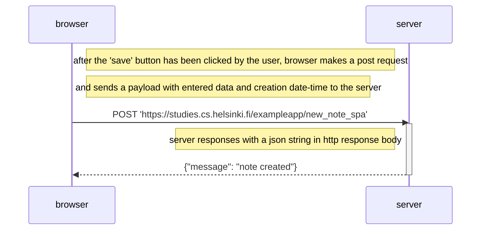

```mermaid
sequenceDiagram
participant browser
participant server

Note right of browser: after the 'save' button has been clicked by the user, browser makes a post request
Note right of browser: and sends a payload with entered data and creation date-time to the server

browser->>server: POST 'https://studies.cs.helsinki.fi/exampleapp/new_note_spa'

activate server
Note left of server: server responses with a json string in http response body
server-->>browser: {"message": "note created"}
deactivate server

```
