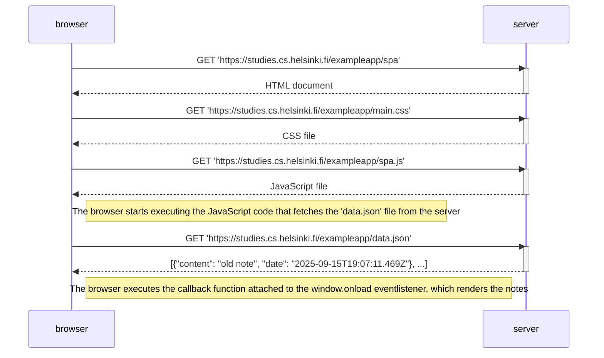

```mermaid

sequenceDiagram
participant browser
participant server

browser->>server: GET 'https://studies.cs.helsinki.fi/exampleapp/spa'

activate server
server-->>browser: HTML document
deactivate server

browser->>server: GET 'https://studies.cs.helsinki.fi/exampleapp/main.css'

activate server
server-->>browser: CSS file
deactivate server

browser->>server: GET 'https://studies.cs.helsinki.fi/exampleapp/spa.js'

activate server
server-->>browser: JavaScript file
deactivate server

Note right of browser: The browser starts executing the JavaScript code that fetches the 'data.json' file from the server

browser->>server: GET 'https://studies.cs.helsinki.fi/exampleapp/data.json'

activate server
server-->>browser: [{"content": "old note", "date": "2025-09-15T19:07:11.469Z"}, ...]
deactivate server

Note right of browser: The browser executes the callback function attached to the window.onload eventlistener, which renders the notes

```
